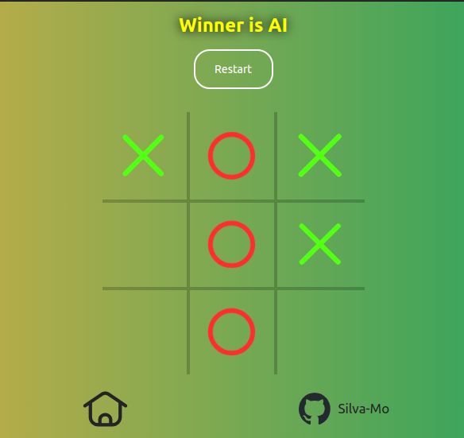

# Tic Tac Toe
## Result

[LIVE DEMO](https://github.com/Silva-Mo/Tic-Tac-Toe)

## About
That is my second TOP JS project. It requires a good understanding of JS (facotry functions and the module pattern) and intermediate HTML/CSS concepts.

Alhamdulillah

## What was needed to complete it:
- Using JS factory functions and modules
- Good CSS skills (Flexbox and Grid)
- Good layout organization and planning
- good problem-solving skills

## Challenges that I've overcome: 
- adding the Minimax algorthim to make an Unbeatable AI